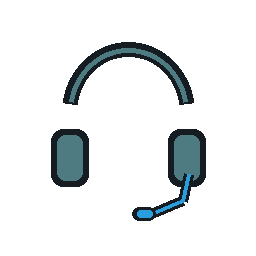

# SteelSeries Sonar for Touch Portal

Плагин для управления **SteelSeries GG Sonar** из [Touch Portal](https://www.touch-portal.com/).
Он даёт быстрый контроль над Streamer Mode: личным миксом, миксом для зрителей,
Master-входом микрофона, громкостью и mute каждого канала.

> Проверено на Windows 11, SteelSeries GG 116.0.0 и Touch Portal 3.1.
> Sonar — Windows-only; macOS и Linux не поддерживаются.

## Возможности

- Выбор устройств для **Monitoring (Personal Mix)** и **Streaming (Audience Mix)**.
- Выбор физического микрофона в **МАСТЕР → Вход микрофона** Sonar.
- Быстрое циклическое переключение микрофонов одной кнопкой.
- Classic / Stream mode, редиректы Classic и Streamer.
- Громкость, изменение громкости и mute по каналам: Master, Game, Chat, Mic,
  Media и Aux.
- Отдельный one-tap mute микрофона.
- Слайдер громкости для Touch Portal.
- States для режима, выбранных устройств, громкости и mute.
- Автопереподключение после перезапуска Sonar или Touch Portal.

## Установка

1. Скачай последний `SteelSeriesSonar-vX.Y.Z.tpp` из
   [Releases](../../releases).
2. В Touch Portal: **Settings → Import plug-in…**.
3. Выбери `.tpp`, затем полностью перезапусти Touch Portal.
4. Действия появятся в категории **SteelSeries Sonar**.

Плагину не нужны права администратора и доступ в интернет. Он общается только
с локальным Sonar API на `127.0.0.1`.

## Быстрый старт: Master microphone

Чтобы менять микрофон, который указан слева в Sonar в поле
**МАСТЕР → Вход микрофона**:

1. Добавь действие **Sonar: Master - Set Microphone Input**.
2. Выбери физический микрофон, например `Microphone (AT2020USB+)` или
   `Headset Microphone (Arctis 7 Chat)`.
3. Для одной кнопки без выпадающего списка используй
   **Sonar: Master - Next Microphone Input**.

Виртуальные Sonar devices намеренно не показываются в этом списке: они не
являются реальными входами Master и могут создать петлю маршрутизации.

## Документация

- [Полное использование](docs/USAGE.md)
- [Устранение неполадок](docs/TROUBLESHOOTING.md)
- [История изменений](CHANGELOG.md)

## Иконки кнопок

Готовые прозрачные PNG для Touch Portal лежат в [`assets/`](assets/):

| Гарнитура | Студийный микрофон |
| --- | --- |
|  |  |

Иконка категории плагина в списке действий и картинка самой кнопки в Touch
Portal — разные элементы. Картинка кнопки назначается вручную в правой панели
редактора кнопки, на вкладке изображения.

## Разработка и сборка

Требования: Python 3.12, PyInstaller и Pillow.

```powershell
python -m pip install pyinstaller pillow
.\build.ps1 -Version 1.0.6
```

Готовый `.tpp` появится в корне проекта. Не коммить `build/`, `dist_build/`
и `.tpp`: опубликованный пакет прикладывается к GitHub Release.

## Ограничения

- Некоторые Classic volume-эндпоинты в GG 116 могут вернуть HTTP 500;
  Streamer-миксы работают стабильно.
- `chatMix` не включён: его старый локальный endpoint отсутствует в GG 116.

## Лицензия

[MIT](LICENSE)
